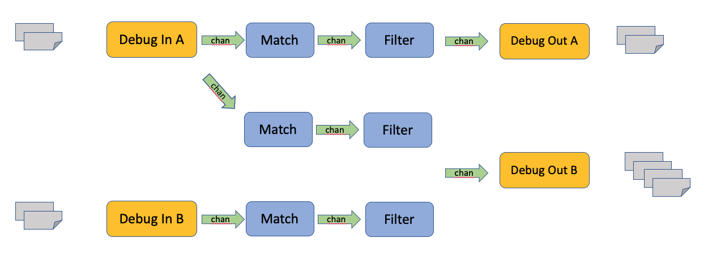

# Table Driven Route Testing

## Test Configuration

The test table describes a sequence of end-to-end route tests like so:

```
    "simpleRouteA": {
      "id": 0,
      "routeFiles": [
        "simpleRouteA"
      ],
      "waitMs": 100,
      "events": [
        {
          "senderRouteFiles": "simpleRouteA",
          "expectedEventCount": 5,
          "expectedEventIndex": 0,
          "expectedEventPayloadFile": "event1"
        }
      ]
    }
```

Each test has a unique test name (here _simpleRouteA_), it refers to one or more
routes by name (here also _simpleRouteA_) and it specifies what kinds of output events 
it expects to see passing through one or more debug sender plugins. In this example 
it expects to find 5 events in the debug sender specified in the route _simpleRouteA_.
Furthermore, the payload of the first event (index 0) is supposed to be equal to the 
event payload given in _event1_. The _waitMs_ parameter gives the number of milliseconds
the test runner should wait before collecting results.

The names of route configuration and event payloads refer to json files by the same
name in the _testdata_ folder.

###simpleRouteA.json

```
{
  "id": "r101",
  "orgId": "comcast",
  "appId": "xfi",
  "userId": "boris",
  "name": "simpleRouteA",
  "receiver": {
    "plugin": "debug",
    "name": "mydebugA",
    "config": {
      "intervalMs": 10,
      "maxHistory": 100,
      "payload": {
        "foo": "bar"
      },
      "rounds": 5
    }
  },
  "sender": {
    "plugin": "debug",
    "name": "simpleRouteSenderA",
    "config": {
      "destination": "stdout",
      "maxHistory": 100
    }
  },
  "deliveryMode": "whoCares"
}
```

### event1.json

```
{
  "foo" : "bar"
}
```

The above example describes a _single-route-test_. Configuring a _multi-route-test_ is equally
straight-forward:

```
"multiRouteAABBAB": {
      "seq": 8,
      "routeFiles": [
        "simpleRouteAA",
        "simpleRouteAB",
        "simpleRouteBB"
      ],
      "waitMs": 100,
      "events": [
        {
          "senderRouteFiles": "simpleRouteAA",
          "expectedEventCount": 5,
          "expectedEventIndex": 0,
          "expectedEventPayloadFile": "event1"
        },
        {
          "senderRouteFiles": "simpleRouteBB",
          "expectedEventCount": 10,
          "expectedEventIndex": 0,
          "expectedEventPayloadFile": "event1"
        }
      ]
    }
```

This test is equivalent to this scenario:



The entire test table can be seen [here](../internal/pkg/app/testdata/table.json).

The test table alos has a few global parameter that apply to all tests:

```
  "sharePluginsAcrossTests": false,
  "testToRunAllIfBlank": "",
  "numInstances": 3,
```

If _sharePluginsAcrossTests_ is set to true, sender and receiver plugins will be shared
across tests provide they have identical name and configuration. This can sometimes cause
unwanted side effects. To avoid this set this parameter to false which will prompt the 
test runner to prefix all plugin names with unique strings thus ensuring plugins will not 
be shared.

_numInstances_ specified the number of EARS instances to run locally during test execution.
All test operation will be carried out on a single EARS instance while the others will 
passively follow along synchronizing their routing tables.

If _testToRunAllIfBlank_ is set to a valid test name only this test will be executed. This 
feature is sometimes useful when working on adding a new test to the table.

## Test Execution

To run all test in the table execute 

```
go test -run TestRouteTable -v

--- PASS: TestRouteTable (6.25s)
    --- PASS: TestRouteTable/simpleFilterMatchPatternAllowRoute (0.41s)
    --- PASS: TestRouteTable/simpleRouteA (0.42s)
    --- PASS: TestRouteTable/simpleRouteB (0.41s)
    --- PASS: TestRouteTable/simpleFilterChainMatchRoute (0.43s)
    --- PASS: TestRouteTable/multiRouteAABB (0.42s)
    --- PASS: TestRouteTable/simpleFilterLongChainRoute (0.41s)
    --- PASS: TestRouteTable/simpleFilterMatchPatternWildRoute (0.41s)
    --- PASS: TestRouteTable/simpleFilterMatchPatternDenyRoute (0.42s)
    --- PASS: TestRouteTable/simpleSplitRoute (0.42s)
    --- PASS: TestRouteTable/simpleDeepSplitRoute (0.41s)
    --- PASS: TestRouteTable/matchFilterDeny (0.41s)
    --- PASS: TestRouteTable/multiRouteAABBAB (0.42s)
    --- PASS: TestRouteTable/simpleFilterUnwrapRoute (0.42s)
    --- PASS: TestRouteTable/matchFilterAllow (0.41s)
    --- PASS: TestRouteTable/simpleFilterTransformRoute (0.42s)
PASS
ok  	github.com/xmidt-org/ears/internal/pkg/app	6.382s
```

Before running any tests the test runner will setup as many EARS instances as specified.
The EARS instances will follow the configurations given in a local
[ears.yaml](../internal/pkg/app/ears.yaml) config file.
The test runner will ensure that persistence layer and delta synchronzier are shared
among those instances even if the _inmemory_ option is chosen. 

For each test the test runner will execute the following steps:

* Prefix plugin names with test name if desired
* Create route(s) via REST API and verify output with golden file
* Check if correct number of routes is present in persistence layer
* Check if correct number of registered / running routes is present in main ears instance
* Check if correct number of registered / running routes is present in passive ears instances
* Check if number of events in debug sender(s) is correct per test spec
* Check if payload of selected events in debug sender(s) is correct per test spec
* Delete all routes of this test via REST API
* Check that no routes are present in persistence layer
* Check that no registered / running routes are present in main ears instance
* Check that no registered / running routes are present in passive ears instances

After all tests have completed all EARS instances will be shut down. 

## List of Tests

Currently the table contains the following tests. The idea is to cover all
filter types and some selected filter chain combinations with single-route-tests. Further we 
are covering some more complex scenarios with selected multi-route-tests.

* simpleRouteA
* simpleRouteB
* simpleSplitRoute
* simpleDeepSplitRoute
* matchFilterAllow
* matchFilterDeny
* simpleFilterMatchPatternAllowRoute
* simpleFilterMatchPatternDenyRoute
* simpleFilterMatchPatternWildRoute
* simpleFilterChainMatchRoute
* simpleFilterLongChainRoute
* simpleFilterUnwrapRoute
* simpleFilterTransformRoute
* multiRouteAABB
* multiRouteAABBAB

To add a new test to the table, add an entry to the 
[test table](../internal/pkg/app/testdata/table.json)
and run `go test -run TestRouteTable -update` to ensure the necessary golden files are produced.

By changing the global test configs and ears.yaml you can run all test in the table in various
environments:

* persistence storage: _inmemory_, _redis_, _dynamodb_ (configure in ears.yaml)
* number of ears instances: 1..N (configure in table.json)
* table synchronization: _none_, _inmemory_, _redis_ (configure ine ars.yaml)

go runs tests concurrently. When running multiple tests, this can cause issues with 
shared storage and shared debug plugins as route counts or event counts may be off. 
Note that is not a concern when running through all the tests in the table because from 
the go perspective we are only executing a single unit test and therefore all internal
(sub)tests are executed one by one in sequence preventing any kind of interference.


