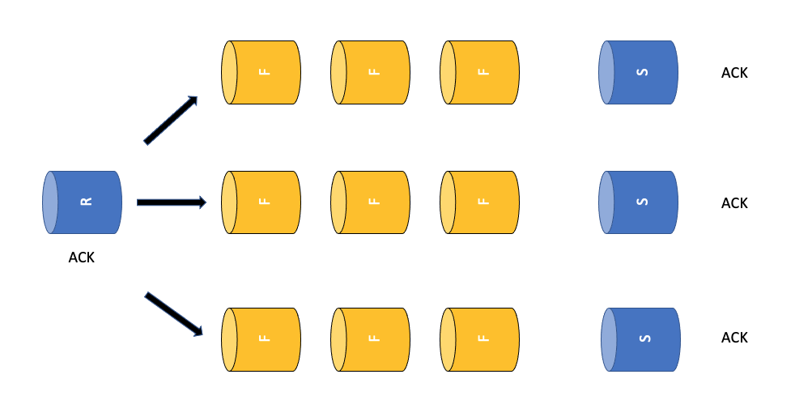
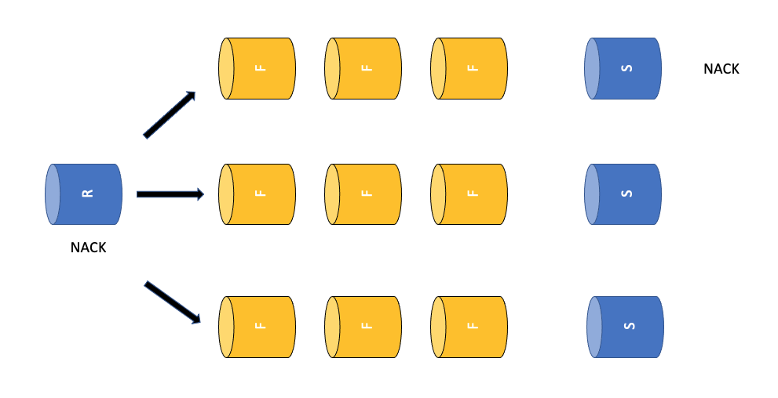
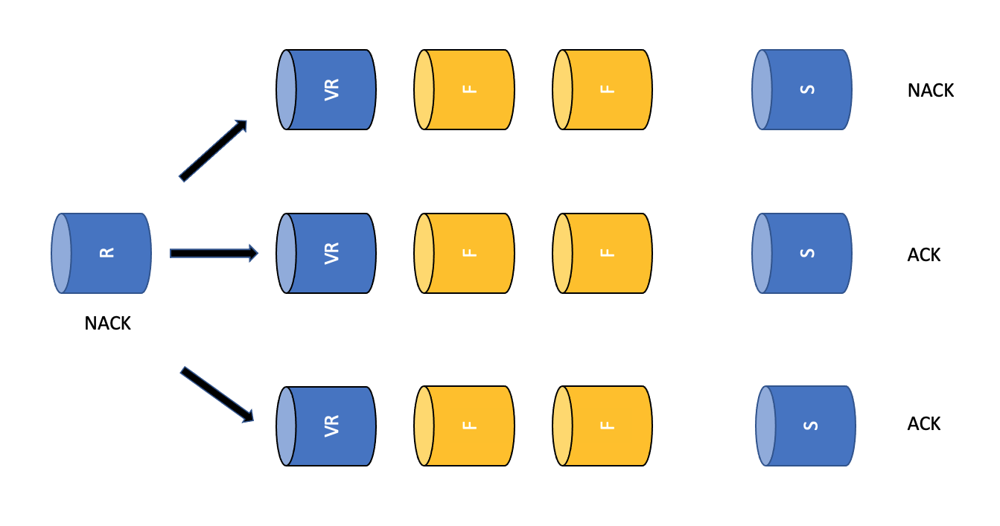

# Notes On Ack, Nack and Retries

## The Current Design And Its Implications

In a scenario where multiple routes share the same receiver, EARS follows a
different algorithm for ack (success case) and nack (failure case). 

After a 
single event fans out into multiple filter chains, EARS collects the acks
for the event. Only after all routes attached to a single receiver instance 
have concluded with an ack, the ack routine of the receiver gets executed.
This routine typically writes some metrics and cancels the event context.



Receiver event orchestration code example for ack and nack:

```
event, err := event.New(ctx, body,
    event.WithAck(
        func(e event.Event) {
            // do success stuff...
            h.eventSuccessCounter.Add(ctx, 1)
            cancel()
        }, func(e event.Event, err error) {
            // do error stuff, potentially initiate retry
            log.Ctx(e.Context()).Error().Str("error", err.Error()).Msg("event error")
            h.eventFailureCounter.Add(ctx, 1)
            cancel()
        },
    ),
    event.WithMetadata(metadata),
)
```

However, if any one of the filters or senders in the route tree finishes with a
nack, the nack routine of the receiver gets executed immediately regardless of 
whether other legs of the route tree are still processing (fail fast). This means, 
depending on timing, that other routes may get canceled before they are able to 
deliver the event to their destination and ack the event. The net affect is that one route can 
seemingly "steal" events from other routes. This side effect only occurs within the same
application but not across applications and organizations. Also notice that this 
is only an issue when multiple routes share the same receiver and some routes end
in ack and some in nack (which may not often be the case in practice).



The receiver orchestrates the lifecycle of an event. In case of all acks, 
the receiver is clearly done with the event and can safely remove it from 
the event source (what exactly that means is protocol specific).
However, the main purpose of a nack is to signal to the receiver
that event processing has failed and that a retry may have a chance of success. 
It is then up to the receiver to decide if a retry should actually be attempted or not.
This decision depends on the retry policy and the receiver configuration.
For example a receiver may implement a policy that allows up to three retries 
but no more than that. The motivation behind the fail-fast on nack is to reduce
the probability of duplicate event delivery. This is because a single nack
will trigger a retry impacting all routes sharing the same receiver. Therefore
the event will be redelivered even to routes that would have concluded or actually 
did conclude in an ack.

## Beware Of Filter Nacks

If a filter decides to consume an event (due to filtering) it should ack the event.
If a filter decides to pass an event on it should neither ack nor nack the event.
Rarely do we have a scenario though where it makes sense for a filter to nack
an event - because that would signal to the receiver that there is hope for success
when retrying the event. However, most filter logic is completely internal and therefore idempotent, thus
throwing the same event at the same filter will lead to the same outcome. A 
notable exception is the webservice filter which makes an http request to an external
service. If reaching an external service fails, a retry may be justified, therefore
the filter may choose to nack.

## Sender Retries - A Strategy For Avoiding Duplicates

One idea to avoid unwanted redelivery (duplicates), is to implement an optional retry policy 
at the sender level. For example, if a sender fails to deliver an event to its destination,
it could quietly perform up to N retries (meaning without ack or nack). If any of the 
retries succeed we can happily ack this back to the receiver. Even if the Nth retry 
attempt fails, we should still ack the event because further retries have diminished hope
for success. By delegating retries to the sender we avoid including other routes from the route tree in the 
retry attempts. The same argument could be made for the webservice filter. By executing
retries locally we can keep the receiver in the dark about what is going on and avoid 
potential duplicates.

## What About Visibility?

Some filters are currently relying on the receiver nack logic to log errors and create metrics.
A typical example goes like this:

```
obj, _, _ := evt.GetPathValue(f.config.Path)
if obj == nil {
    evt.Nack(errors.New("nil object in " + f.name + " at path " + f.config.Path))
    return []event.Event{}
}
```

This code pattern is usually a bad idea because it leads to event stealing and duplicates as 
outlined above.

When filtering events due to either benign or permanent errors it is preferable to write logs
and traces locally and actually ack the event.

```
obj, _, _ := evt.GetPathValue(f.config.Path)
if obj == nil {
	log.Ctx(evt.Context()).Error().Str("op", "filter").Str("filterType", "ttl").Str("name", f.Name()).Msg("nil object at " + f.config.Path)
    span := trace.SpanFromContext(evt.Context())
    if span != nil {
        span.AddEvent("nil object at " + f.config.Path)
    }
    evt.Ack()
    return []event.Event{}
}
```

## Ideas For Further Thought: Virtual Receivers And SenderReceivers

The issues with event stealing and unwanted duplicates really are rooted in the fact that multiple routes share a single
receiver orchestrating the event's life cycle. This is done for good reason so that the receiver can make sensible decisions
when negotiating the event's durability with the event source (SQS, Kafka, Kinesis etc.).

One way out of this dilemma may be the creation of _Virtual Receivers_ that then control the retry policy for a single 
linear route rather than an entire event tree. This idea will need further development and will likely not be trivial to
implement. Also, a _SenderReceiver_ combination has been proposed as a potential solution to this problem. 



In either case the question
of event durability arises. So far EARS has not been required to store events while in transit because instead EARS could
leverage the event source's persistence features (note here that exceeding the source queue's durability guarantees in EARS would 
make no sense!). If we introduce _VirtualReceivers_ or something similar, EARS may have to store events temporarily to 
meet delivery guarantees. In this context it may to useful to create helper routes that "park" events temporarily inside
a durable queue such as Kafka. This EARS may not be required to implement its own event persistence layer.


