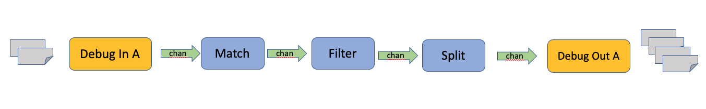
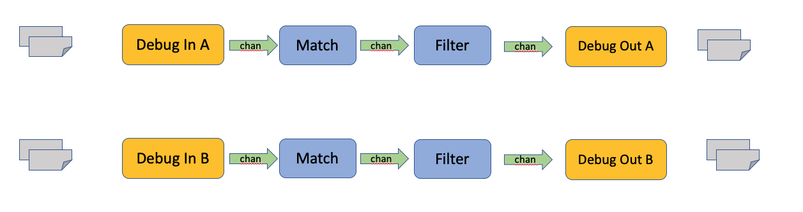
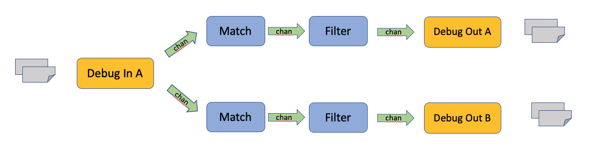
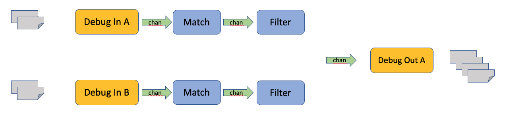

# Table Driven Unit Tests

## Single Route Tests

[test_table_single_route.json](../internal/pkg/route/testdata/test_table_single_route.json)

## Multi Route Tests

[test_table_multi_route.json](../internal/pkg/route/testdata/test_table_multi_route.json)

## Single Route Test - Match & Filter

## Single Route Test - Match & Filter 2

## Single Route Test - Direct Route

## Single Route Test - Split Route

## Multi Route Test - Distinct Routes

## Multi Route Test - Shared Source 

## Multi Route Test - Shared Destination

## Multi Route Test - Mixed Routes

