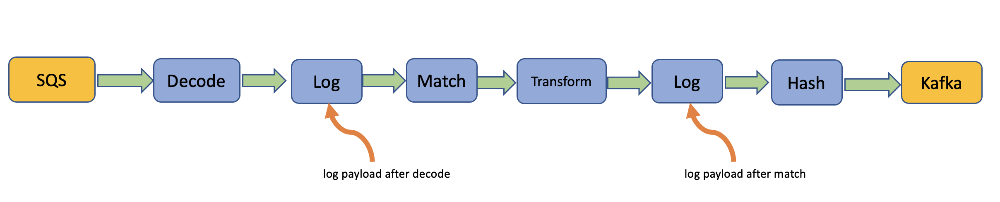
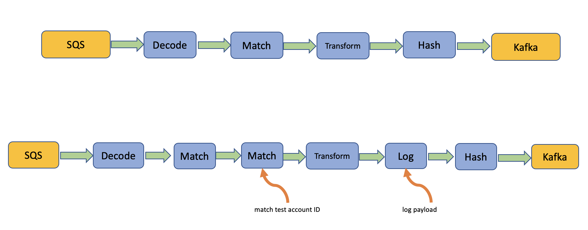
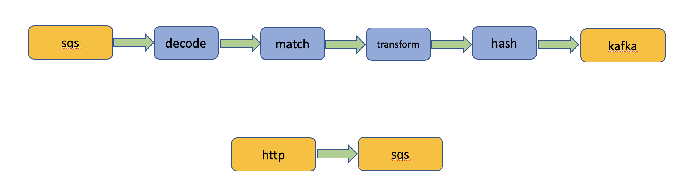

# Debug and Test Strategies

There are some useful techniques available to you for developing, testing and debugging routes in EARS.
Often times you can debug a route by either replacing sender and receiver plugins with debug plugins or
by adding special filter plugins, such as the log filter, to gain more visibility into how the route
operates on a particular event payload. In other situations it is helpful to temporarily creare a helper
route that can be removed once testing is complete.

The tools EARS offers for this purpose are:

#### Debug Receiver Plugin 

Produces any number of hardcoded test events and inject them into the filter chain.

```
{
  "receiver" : {
    "plugin" : "debug",
    "config" :
    {
      "rounds" : 5,
      "intervalMs" : 10,
      "payload" : {
        "foo" : "bar"
      }
    }
  }
}
```

#### Debug Sender Plugin 

Prints event payload and metadata to stdout and logs at info level.

```
{
  "sender": {
    "plugin": "debug",
    "name": "myDebugSender",
    "config": {
      "destination": "stdout"
    }
  }
}
```

#### Log Filter

Prints event payload and metadata to stdout and logs at info level at the point in the filter chain where it is placed.

```
{
  "plugin" : "log"
}
```

## Technique 1 - Add Log Filters To Route

By adding log filters at various places in the filter chain you can observe how the event payload and 
metadata changes as the event travels through the filter chain. You can also use this technique to find out
if an event makes it past a match filter or not.



## Technique 2 - Log Only Whitelisted Events

If your route has high event throughput, you may generate too much log data using technique 1. In this case
it may be better to create a seconds route, similar to the route you are testing but with an added match filter
and all the log filters you need. The match filter should then be configured to select only a small sample of
incoming events, for example by matching for one or a few different identifiers in your payload.



## Technique 3 - Inject Test Events Into Route

Sometimes you want to inject a test event into a route to make sure it operates correctly after deployment. This 
can be very useful for end-to-end integration tests. Again you can create a helper route, that either uses an 
http plugin as a webhook or even a debug receiver plugin to inject any number of test events.



## Technique 4 - Drain Data Sources

Sometime you end up with some data source that is clogged with old test events you want to get rid of. Again a route
can come to the rescue. Simply deploy a drain route that consumes all events from your data source and throws them
away by sending them to a debug sender.

Example:

```
{
  "id": "dk1",
  "userId": "boris",
  "name": "drainKafkaRoute",
  "receiver": {
    "plugin": "kafka",
    "name": "drainKafkaReceiver",
    "config": {
      "brokers": "localhost:9092",
      "topic": "ears-demo",
      "groupId": "mygroup"
    }
  },
  "sender" : {
    "plugin" : "debug",
    "name" : "drainKafkaSender",
    "config" : {
      "destination" : "stdout"
    }
  }
}
```


