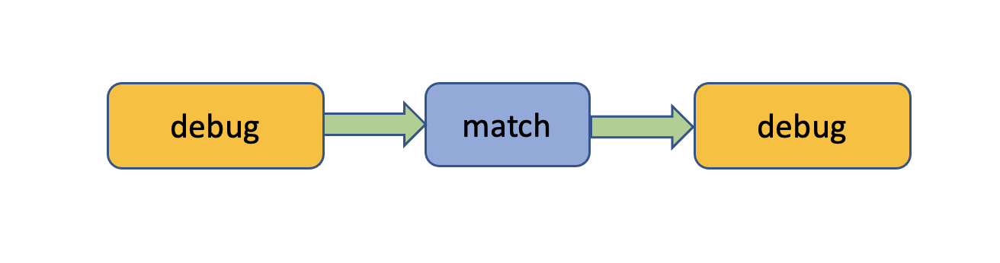
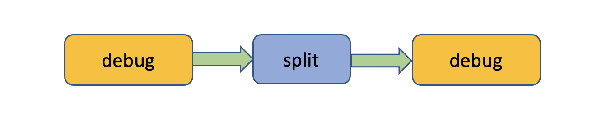
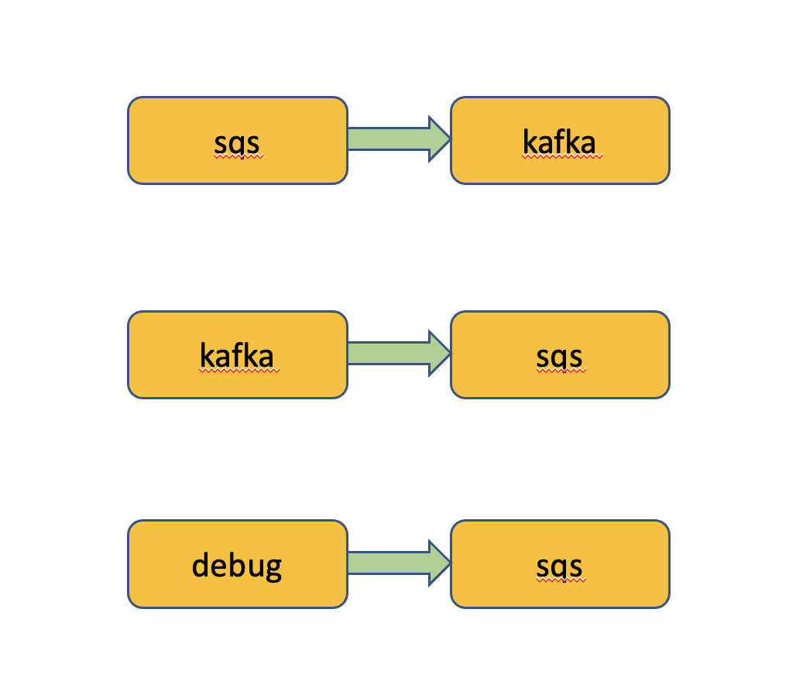

# Simple Examples

## Running EARS Locally

```
git clone https://github.com/xmidt-org/ears.git
cd ears/cmd/ears
go build
./ears run
```

You may want to edit the EARS configuration file [_ears.yaml_](config.md) located in the same folder before starting 
the EARS service. After starting the service you should be able to reach the service endpoint here:

```
curl http://localhost:3000/ears/version
```

## Setting Tenant Quota

Routes always have to be added under a tenant with org ID and app ID. This means that you must create a
tenant and set its event throughput quote before you can create any routes. In the following we will work
with the test org _myorg_ and the test app _myapp_.

```
{
  "quota": {
    "eventsPerSec": 2000
  }
}
```

```
curl -X PUT http://localhost:3000/ears/v1/orgs/myorg/applications/myapp/config --data-binary @quota.json
```

## Demo 1

Send five foo-bar-events 10 milliseconds apart to stdout. The filter chain contains a regex matcher which
will let any event payload pass. Note that we choose _demo1_ as route ID. If you leave the _id_ field blank,
EARS will choose a random route ID for you. The route ID will be included in the API response. Check the EARS
logs for the foo-bar events hitting the debug sender. 



```
{
  "id" : "demo1",
  "userId" : "boris",
  "name" : "simpleMatchAllowFilterRoute",
  "receiver" : {
    "plugin" : "debug",
    "name" : "simpleFilterMatchAllowRouteReceiver",
    "config" :
    {
      "rounds" : 5,
      "intervalMs" : 10,
      "payload" : {
        "foo" : "bar"
      }
    }
  },
  "sender" : {
    "plugin" : "debug",
    "name" : "simpleFilterMatchAllowRouteSender",
    "config" : {
      "destination" : "stdout"
    }
  },
  "filterChain" : [
    {
      "plugin" : "match",
      "name" : "simpleFilterMatchAllowRouteMatcher",
      "config" : {
        "mode" : "allow",
        "matcher" : "regex",
        "pattern" : "^.*$"
      }
    }
  ]
}
```

```
curl -X POST http://localhost:3000/ears/v1/orgs/myorg/applications/myapp/routes --data-binary @demo1.json
```

## Demo 2

Send five foo-bar array events. The filter chain uses a split filter to break up the arrays into individual
events so that we will receive a total of 10 events.



```
{
  "id" : "s2",
  "userId" : "boris",
  "name" : "simpleFilterSplitRoute",
  "receiver" : {
    "plugin" : "debug",
    "name" : "simpleFilterSplitRouteReceiver",
    "config" :
    {
      "rounds" : 5,
      "intervalMs" : 10,
      "payload" : [
        {
          "foo" : "bar"
        },
        {
          "foo" : "bar"
        }
      ]
    }
  },
  "sender" : {
    "plugin" : "debug",
    "name" : "simpleFilterSplitRouteSender",
    "config" : {
      "destination" : "stdout"
    }
  },
  "filterChain" : [
    {
      "plugin" : "split",
      "name" : "simpleFilterSplitRouteSplitter",
      "config" : {
        "path" : "."
      }
    }
  ]
}
```

```
curl -X POST http://localhost:3000/ears/v1/orgs/myorg/applications/myapp/routes --data-binary @demo2.json
```

## Demo 3

Here we are looking at two routes: One sends events from a SQS queue to a Kafka topic. The other sends events
from the same Kafka topic to the same SQS queue. Finally, you can use a third route to inject a handful of events
into either the SQS queue or the Kakfa topic to get things started. From then on these events will oscillate between 
Kafka and SQS forever.



```
{
  "id": "sk1",
  "userId": "boris",
  "name": "sqsKafkaRoute",
  "receiver": {
    "plugin": "sqs",
    "name": "sqsKafkaReceiver",
    "config": {
      "queueUrl": "https://sqs.us-west-2.amazonaws.com/{aws_account_id}/ears-demo"
    }
  },
  "sender": {
    "plugin": "kafka",
    "name": "sqsKafkaSender",
    "config": {
      "brokers": "localhost:9092",
      "topic": "ears-demo"
    }
  }
}

```

```
{
  "id": "ks1",
  "userId": "boris",
  "name": "kafkaSqsRoute",
  "receiver": {
    "plugin": "kafka",
    "name": "kafkaSqsReceiver",
    "config": {
      "brokers": "localhost:9092",
      "topic": "ears-demo",
      "groupId": "mygroup"
    }
  },
  "sender": {
    "plugin": "sqs",
    "name": "kafkaSqsSender",
    "config": {
      "queueUrl": "https://sqs.us-west-2.amazonaws.com/{aws_account_id}/ears-demo"
    }
  }
}
```

```
{
  "id": "is1",
  "userId": "boris",
  "name": "injectSqsRoute",
  "receiver" : {
    "plugin" : "debug",
    "name" : "injectSqsReceiver",
    "config" :
    {
      "rounds" : 5,
      "intervalMs" : 10,
      "payload" : {
        "foo" : "bar"
      }
    }
  },
  "sender": {
    "plugin": "sqs",
    "name": "injectSqsSender",
    "config": {
      "queueUrl": "https://sqs.us-west-2.amazonaws.com/{aws_account_id}/ears-demo"
    }
  },
}
```

Finally, once you had enough of watching the events rotate through the two routes, you can use another
route to drain the SQS queue so that all events will eventually get sucked out of this demo.

```
{
  "id": "ds1",
  "userId": "boris",
  "name": "drainSqsRoute",
  "receiver": {
    "plugin": "sqs",
    "name": "sqsKafkaReceiver",
    "config": {
      "queueUrl": "https://sqs.us-west-2.amazonaws.com/{aws_account_id}/ears-demo"
    }
  },
  "sender" : {
    "plugin" : "debug",
    "name" : "drainSqsSender",
    "config" : {
      "destination" : "stdout"
    }
  }
}
```

## Demo 4

Delete the routes of demo 1-3.

```
curl -X DELETE http://localhost:3000/ears/v1/orgs/myorg/applications/myapp/routes/s1

curl -X DELETE http://localhost:3000/ears/v1/orgs/myorg/applications/myapp/routes/s2

curl -X DELETE http://localhost:3000/ears/v1/orgs/myorg/applications/myapp/routes/ks1

curl -X DELETE http://localhost:3000/ears/v1/orgs/myorg/applications/myapp/routes/sk1

curl -X DELETE http://localhost:3000/ears/v1/orgs/myorg/applications/myapp/routes/is1

curl -X DELETE http://localhost:3000/ears/v1/orgs/myorg/applications/myapp/routes/ds1
```


