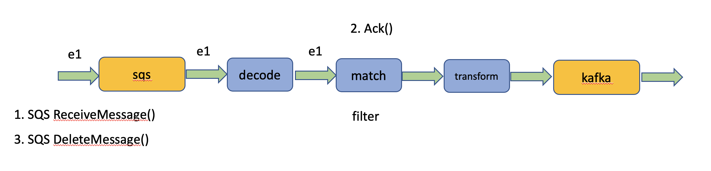
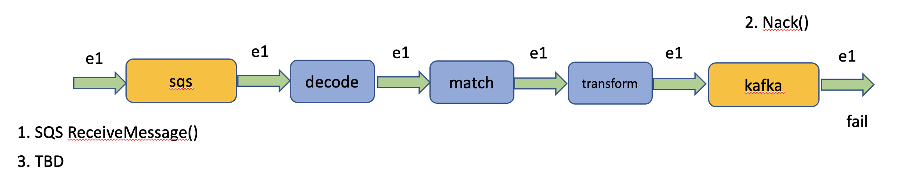

# Receiver Plugin Reference

Receiver plugins receive events from event sources. An EARS route is protocol agnostic, but a
receiver plugin understands the specifics of its event source protocol and encapsulates the 
necessary implementation details.  

Each receiver plugin instance is determined by its ID, its type, its optional name and its
protocol specific configuration such as topic name or broker endpoint.

```
{
  "receiver": {
    "plugin": "{receiverType}",
    "name": "{optionalReceiverName}",
    "config": {
      "param1": "value1",
      "param2": "value2",
      "...": "...",
    }
  }
}
```

When determining whether two plugin configurations are identical for the purpose of stream sharing or to
find out whether a plugin instance needs updating, EARS calculates a hash over all these parameters and
compares that hash against other hashes.

```
pluginHash = md5(pluginType, pluginName, pluginConfigurationJson)
```

By choosing unique plugin names it is possible to force EARS to use two distinct receiver plugin instances
for two routes with otherwise identical receiver plugin configurations.

## Ack() and Nack()

After receiving an event from the event source the receiver
plugin delivers copies of the event to all interested routes. For each event copy, the receiver plugin
waits until the event gets either acknowledged (ack()) or not acknowledged (nack()) by the route or until
the event times out (typically after 5 seconds). It is then up to the receiver plugin to decide
whether the event has been dealt with or whether the event should be retried. In this sense it is
the receiver plugin's responsibility to orchestrate and oversee any event delivery policies.

### Scenario 1


In this example we use an SQS receiver. When the SQS receiver receives a message from its SQS queue it
doesn't immediately delete it from the queue. Therefore, the message remains in the custody of the SQS
queue. The event successfully passes through the filter chain and the Kafka sender successfully delivers 
the transformed message to its Kafka topic. In this case the Kafka receiver calls Ack() on the event. 
The event acknowledgement is signalled back to the SQS receiver which now safely deletes the message 
from the SQS queue. The transfer of custody from SQS to Kafka is now complete and we can guarantee with
confidence that there is no chance of message loss as a result of the event passing through EARS.

### Scenario 2



This example is similar to the first example, but here the event gets dropped by the match filter. Even
though the event never makes it to Kafka, the event was processed successfully (according to the criteria 
defined in the route) and therefore the match filter will call Ack() on the event and the SQS receiver 
will delete the event from SQS. Note that all that matters to the receiver is the fact that the event was
acknowledged. The receiver does not care whether the event was acknowledged by a filter or a sender - in fact 
the receiver is not even aware of the difference.

### Scenario 3



In this scenario the event passes all the way to the Kafka sender but then the sender fails to deliver the
event to its Kafka topic, perhaps due to a temporary network issue. Therefore the Kafka sender will call
Nack() on the event and the SQS receiver will be informed that the event could not be acknowledged. It is now 
up to the receiver to decide what to do. If there is hope that the event could be delivered successfully 
on retry, the receiver may try to redeliver the event a number of times. In the case of SQS the receiver does 
not have to do anything in this case: By never deleting the message from SQS it will automatically be delivered
again by the SQS queue after some time. The SQS receiver does monitor, however, how many times the event
was redlivered by SQS (this information is available in the SQS event metadata) and the receiver could and
should delete the message after a number of retries even if the event always ends in Nack().
Or, the receiver could choose to move the event to a dead letter queue instead. The policy that the receiver
can apply is highly protocol specific and should be part of the receiver configuration. Currently the SQS
receiver monitors how many times an event has been redelivered by SQS and will simply delete the event from
SQS after the third retry attempt, successful or not.

### Scenario 4

A fourth scenario occurs when an event gets "stuck" in a filter or sender plugin. In this case a golang context
timeout will result in Nack() which will be treated the same as described in scenario 3. Typically the event
timeout is set to 5 seconds. The event timeout period is currently not configurable in the route. 

## Secrets Management

Some receivers require authentication information in the for of access token s etc. There are several reasons
why you would not want such tokens to be part of the route configuration itself: (1) Large access tokens make the 
route less readable, (2) every key rotation will require redployment of the route and change the plugin hash 
and (3) there are security concerns about secrets then being visible in the response of the GetRoutes() APIs.
Therefore, EARS supports a simple layer of indirection where you can refer to a secret by a short name instead 
palcing the secret itself directly into the route. For this purpose EARS supports the following syntax for 
selected plugin configurations: `secret://kafka.accessCert`. Currently EARS only supports using the service 
configuration file ears.yaml as a data store for secrets. Your ears.yaml must contain the following section:

```
ears:
    secrets:
        myorg:
            myapp:
                kafka:
                    accessCert: |-
                        ...
                    accessKey: |-
                        ...
```

Note that secrets are isolated by org ID and app ID for multi tenancy.

## Available Receiver Plugins

* kafka
* kinesis
* sqs
* redis
* http
* debug

### Kafka Receiver Plugin

Example Configuration:

```
{
  "receiver": {
    "plugin": "kafka",
    "name": "myKafkaReceiver",
    "config": {
      "groupId": "myGroup"
    }
  }
}
```

Parameters:

```
type ReceiverConfig struct {
	Brokers             string `json:"brokers,omitempty"`
	Topic               string `json:"topic,omitempty"`
	GroupId             string `json:"groupId,omitempty"`
	Username            string `json:"username,omitempty"` // yaml
	Password            string `json:"password,omitempty"`
	CACert              string `json:"caCert,omitempty"`
	AccessCert          string `json:"accessCert,omitempty"`
	AccessKey           string `json:"accessKey,omitempty"`
	Version             string `json:"version,omitempty"`
	CommitInterval      *int   `json:"commitInterval,omitempty"`
	ChannelBufferSize   *int   `json:"channelBufferSize,omitempty"`
	ConsumeByPartitions bool   `json:"consumeByPartitions,omitempty"`
	TLSEnable           bool   `json:"tlsEnable,omitempty"`
}
```

Default Values:

```
{
	brokers:           "localhost:9092",
	topic:             "quickstart-events",
	groupId:           "",
	username:          "",
	password:          "",
	caCert:            "",
	accessCert:        "",
	accessKey:         "",
	version:           "",
	commitInterval:    1,
	channelBufferSize: 0
}
```

### Kinesis Receiver Plugin

Example Configuration:

```
{
  "receiver": {
    "plugin": "kinesis",
    "name": "myKinesisReceiver",
    "config": {
      "streamName": "ears-demo"
    }
  }
}
```

Parameters:

```
type ReceiverConfig struct {
	StreamName         string `json:"streamName,omitempty"`
	ReceiverPoolSize   *int   `json:"receiverPoolSize,omitempty"`
	AcknowledgeTimeout *int   `json:"acknowledgeTimeout,omitempty"`
	ShardIteratorType  string `json:"shardIteratorType,omitempty"`
}
```

Default Values:

```
{
	streamName:         "",
	receiverPoolSize:   1,
	acknowledgeTimeout: 5,
	shardIteratorType:  "LATEST",
}
```

### SQS Receiver Plugin

Example Configuration:

```
{
  "receiver": {
    "plugin": "sqs",
    "name": "mySqsReceiver",
    "config": {
      "queueUrl": "https://sqs.us-west-2.amazonaws.com/{awsAccountId}/ears-demo",
      "receiverPoolSize": 1,
      "visibilityTimeout": 5
    }
  }
}
```

Parameters:

```
type ReceiverConfig struct {
	QueueUrl            string `json:"queueUrl,omitempty"`
	MaxNumberOfMessages *int   `json:"maxNumberOfMessages,omitempty"`
	VisibilityTimeout   *int   `json:"visibilityTimeout,omitempty"`
	WaitTimeSeconds     *int   `json:"waitTimeSeconds,omitempty"`
	AcknowledgeTimeout  *int   `json:"acknowledgeTimeout,omitempty"`
	NumRetries          *int   `json:"numRetries,omitempty"`
	ReceiverQueueDepth  *int   `json:"receiverQueueDepth,omitempty"`
	ReceiverPoolSize    *int   `json:"receiverPoolSize,omitempty"`
	NeverDelete         *bool  `json:"neverDelete,omitempty"`
}
```

Default Values:

```
{
	queueUrl:            "",
	maxNumberOfMessages: 10,
	visibilityTimeout:   10,
	waitTimeSeconds:     10,
	acknowledgeTimeout:  5,
	numRetries:          0,
	receiverQueueDepth:  100,
	receiverPoolSize:    1,
	neverDelete:         false
}
```

_neverDelete_, when set to true will prevent the SQS receiver from ever deleting messages from the queue. This setting
can be useful when testing with events consumed from a production queue to avoid the risk of message loss.

### Redis Receiver Plugin

Example Configuration:

```
{
  "receiver": {
    "plugin": "redis",
    "name": "myRedisReceiver",
    "config": {
      "channel" : "ears_demo"
    }
  }
}
```

Parameters:

```
type ReceiverConfig struct {
	Endpoint string `json:"endpoint,omitempty"`
	Channel  string `json:"channel,omitempty"`
}
```

Default Values:

```
{
	endpoint: "localhost:6379",
	channel:  "ears",
}
```

### Http Receiver Plugin

Example Configuration:

```
{
    "path" : "mywebhook,
    "method" : POST",
    "port" : 8080
}

```

Parameters:

```
type ReceiverConfig struct {
	Path   string `json:"path"`
	Method string `json:"method"`
	Port   *int   `json:"port"`
}
```

Default Values:

```
{
}
```

### Discord Receiver Plugin
This plugin is to use the Discord Gateway API to listen to discord messages that happens in Discord server(s) through a user created Discord bot, so a botToken is required for plugin config.
It's very unlikely that a personal Discord bot gets assigned more than 1 shard, so the sharded implementation for this plugin is mainly for occassion that user needs to run Ears in a multi-instance enviroment.
If you want to perform event filtering or transformation, a common discord message event looks like this:
```
{
	"id": "11111111111111111111",
	"channel_id": "222222222222222222",
	"guild_id": "3333333333333333333",
	"content": "hey",
	"timestamp": "2023-05-11T07:09:09.256Z",
	"edited_timestamp": null,
	"mention_roles": [],
	"tts": false,
	"mention_everyone": false,
	"author": {
		"id": "227684442083295233",
		"email": "",
		"username": "Jane.Doe",
		"avatar": "",
		"locale": "",
		"discriminator": "1234",
		"token": "",
		"verified": false,
		"mfa_enabled": false,
		"banner": "",
		"accent_color": 0,
		"bot": false,
		"public_flags": 0,
		"premium_type": 0,
		"system": false,
		"flags": 0
	},
	"attachments": [],
	"embeds": [],
	"mentions": [],
	"reactions": null,
	"pinned": false,
	"type": 0,
	"webhook_id": "",
	"member": {
		"guild_id": "",
		"joined_at": "2023-04-06T20:08:28.761Z",
		"nick": "",
		"deaf": false,
		"mute": false,
		"avatar": "",
		"user": null,
		"roles": [],
		"premium_since": null,
		"pending": false,
		"permissions": "0",
		"communication_disabled_until": null
	},
	"mention_channels": null,
	"activity": null,
	"application": null,
	"message_reference": null,
	"referenced_message": null,
	"interaction": null,
	"flags": 0,
	"sticker_items": null
}
```

Example Configuration:

```
{
	"botToken": "xxxxxxxxxxxxxxxxxxxxxxxxxx",
	"useShardMonitor": true
}
```

Parameters:

```
type ReceiverConfig struct {
	BotToken        string `json:"botToken"`
	UseShardMonitor *bool  `json:"useShardMonitor,omitempty"`
}
```

Default Values:

```
{
	"botToken": "",
	"useShardMonitor": false
}
```

### Debug Receiver Plugin

Use this receiver plugin as a data source for debugging purposes. The debug receiver plugin can produce an arbitrary 
number of hardcoded JSON events defined directly in the receiver configuration.

Example Configuration:

```
{
  "receiver" : {
    "plugin" : "debug",
    "config" :
    {
      "rounds" : 5,
      "intervalMs" : 10,
      "payload" : {
        "foo" : "bar"
      }
    }
  }
}
```

Parameters:

```
type ReceiverConfig struct {
	IntervalMs *int        `json:"intervalMs,omitempty"`
	Rounds     *int        `json:"rounds,omitempty"` // (-1) signifies infinite routes
	Payload    interface{} `json:"payload,omitempty"`
	MaxHistory *int        `json:"maxHistory,omitempty"`
}
```

Default Values:

```
{
	intervalMs: 100,
	rounds:     4,
	payload:    "debug message",
	maxHistory: 100,
}```

_rounds_ defines how many events should be sent.

_intervalMs_ defines how many milliseconds to pause bewteen any two events.

_payload_ is the hardcoded test event payload.

_maxHistory_ defines the number of past events to keep. Begins replacing the oldest event when the buffer is full.


