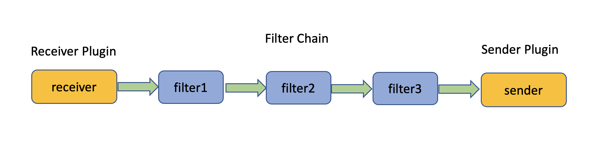
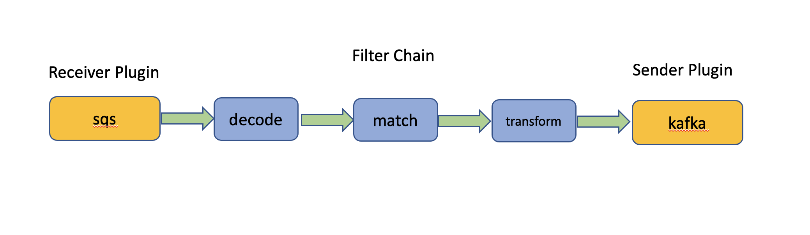
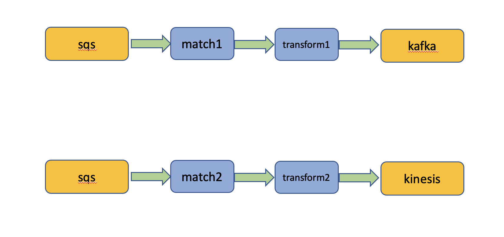
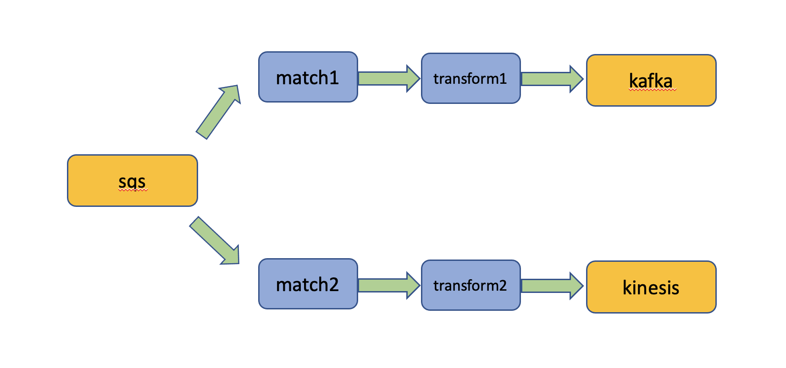

# Routes

Routes are the core concept of EARS. As a user of EARS your business is adding new routes, updating existing 
routes and deleting routes. To make the most of EARS, it is crucial to gain an in-depth understanding of how 
routes work in EARS.

Routes connect data sources to data destinations, for example you can connect an SQS queue to a Kafka topic. 
Events travelling through such a route can be transformed or filtered according to the configuration details of 
the route.
 
A route consists of a linear sequence of a receiver plugin, followed by zero, one or more filter plugins (the filter chain) 
and a sender plugin. Note that the filter chain can be empty in which case the route simply consists of a receiver 
directly connected to a sender. In either case a route processes events asynchronously, one at a time in sequence.

A real life example may look like this:

The receiver plugin of a route receives events from an event source. The receiver plugin encapsulates all protocol 
specific implementation and configuration details. EARS currently offers receiver plugins for Kafka, Kinesis, SQS, Redis
Pub/Sub and HTTP. The receiver plugin passes each event it receives from its event source to the filter chain
Each filter plugin in the filter chain is configured to perform a specific task. EARS offers a small library of highly 
generic and configurable filters to perform various types of payload transformations and filtering of events that do 
not meet predefined criteria such as presence or absence of a certain key value pair in the payload etc. After
traveling through the filter chain, events finally arrive at the sender plugin which will then deliver the events to
a data destination. Again EARS offers a set of configurable sender plugins for Kafka, Kinesis, SQS, Redis
Pub/Sub and HTTP.

Conceptually You may think of a route as a linear flow where a receiver plugin is followed by some filter plugins 
which are followed by a sender plugin. There are no forks or loops allowed in the filter chain of the route. 

## JSON or YAML

When manipulating routes using the EARS API you may submit route configurations either using JSON or YAML
encoding. Often JSON route configurations suffice but whenever a route contains multi-line strings such as 
lengthy JavaScript in a _js_ filter then using YAM encoding may result in more readable route configurations.

## Routing Table Synchronization

## Stream Sharing

